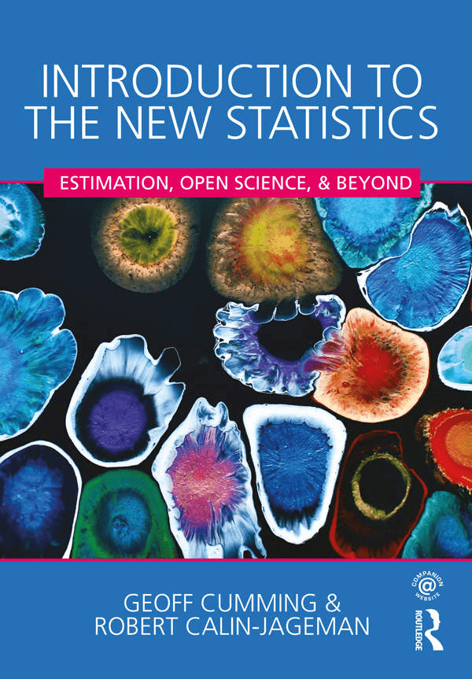

# itns-interactive

This repo works in conncection with the book interactive exercises for [itns-exercises](https://bookdown.org/pbaumgartner/itns-exercises/), an interactive companion book for [Introduction to the New Statistics](https://www.routledgetextbooks.com/textbooks/9781138825529/) (abbreviated <i>itns</i>). 

`itns-exercises` is the central part of the book containing all H5P-exercises and the R solutions for the end-of-chapter exercises. `itns-interactive` supplements the main book with exercises written in `learnr` and `shiny`. Whereas the content of the main book is published at the [bookdown server](https://bookdown.org/) are the interactive demonstrations of this repository published of the [shinyapps server](https://www.shinyapps.io/).

At the moment (July 2020) the following shinyapps are available:

+ [Order Steps of the Research Process](https://pbaumgartner.shinyapps.io/itns-research-steps/)
+ [Histogram & Bins](https://pbaumgartner.shinyapps.io/histogram/)
+ [Picture Data (Histogram & Dotplot with Descriptive Measures)](https://pbaumgartner.shinyapps.io/picture-data/)

But to get a fuller picture visit [itns-exercises](https://bookdown.org/pbaumgartner/itns-exercises/), It has with July 2020 exercises 43 exercises, 9 quizzes and some end-of-chapter exercises (chapter 3 and 4 of _itns_)
